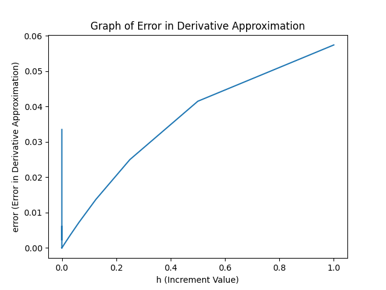

# FCM Coding Example: Approximation of the Derivative of a Function

The derivative is a fundamental too starting in Calculus and in some cases Precalculus Algebra. As a tool in our mathematical toolkit, the derivative is like your trusty old Swiss Army knife or multitool that has the logo worn off.


In scientific computing we use derivatives in the solution of root finding problems, optimization problems, differential equations, and a whole pile of other related problems. What we will do in this module is look at problems  that occur when the derivative of a function is approximated.

### A Definition of the Derivative

In most calculus textbooks, the presentation will go through limits of functions and continuity, followed by concepts the define and apply derivatives. In this module it is assumed that you have a handle on the definitions of limits and continuity. We will start with the definition of the derivative.

> **Definition:** Suppose the function, $$f(x)$$, is defined in an open interval, $$(a,b)$$, then $$f$$ is differentiable at $$x_1\in(a,b)$$, if the limit
> $$$
>  f'(x_1) = \lim_{x_2\rightarrow\ x_1}\ \frac{f(x_2)-f(x_1)}{x_2-x_1}
> $$$
> exists. If the limit exists, the value of the derivative is, $$f'(x_1)$$. If the function
> is differentiable at each point in $$(a,b)$$, we say that the function is
> differentiable on the interval $$(a,b)$$.

For the purposes of computing approximate derivatives, the quantity
$$$
  \Delta f = f(x_2) - f(x_1)
$$$
is the difference of $$f$$  (usually) close to $$x_1$$ and $$\Delta x=(x_2-x_1)$$ is an increment or difference in the independent variable, $$x$$, (usually) near $$x_1$$. The quantity
$$$
  \frac{\Delta f}{\Delta x} = \frac{f(x_2)-f(x_1)}{x_2-x_1}
$$$
is referred to as the **difference quotient** of $$f$$ at $$x_1$$. In terms of mathematical notation, we will say
$$$
  f'(x_1) = \lim_{x_2\rightarrow\ x_1}\ \frac{\Delta f}{\Delta x}
$$$
which is equivalent to
$$$
   f'(x_1) = \lim_{\Delta x\rightarrow\ 0}\ \frac{\Delta f}{\Delta x}
$$$
In practical terms, we can say that as $$\Delta x$$ gets close to zero, the value of the difference quotient will get closer to the derivative of the function at $$x_1$$, $$f'(x_1)$$.

We will try to verify the limits on difference quotients for simple functions By writing a computer code to compute approximate derivative values we can see how well the ideas of this section will work. You should note that the difference quotient can be written a number of ways. One way is to make a simple substitution, $$x_2=x_1+h$$. The result will be
$$$
  \frac{\Delta f}{\Delta x} = \frac{f(x_2)-f(x_1)}{x_2-x_1} = \frac{f(x_1+h)-f(x_1)}{x_1+h-x_1} = \frac{f(x_1+h)-f(x_1)}{h}
$$$
or choosing $$x_1=x=a$$ and
$$$
  \frac{\Delta f}{\Delta x} = \frac{f(x+h)-f(x)}{h} = \frac{f(a+h)-f(a)}{h}
$$$
These last expressions are especially helpful in analyzing the accuracy of the approximation we are working with.

As one last note, consider the limits we have been using to define the derivative. There are a number of algebraically equivalent difference forms that can be used to approximate the derivative of a function. We will use the following definitions interchangeably.
$$$
   f'(x_1) = \lim_{x_2\rightarrow\ x_1}\ \frac{f(x_2)-f(x_1)}{x_2-x_1}
$$$
$$$
  f'(x_1) = \lim_{h\rightarrow\ 0}\ \frac{f(x_1+h)-f(x_1)}{h}
$$$
$$$
  f'(x) = \lim_{h\rightarrow\ 0}\ \frac{f(x+h)-f(x)}{h}
$$$
and
$$$
  f'(a) = \lim_{h\rightarrow\ 0}\ \frac{f(a+h)-f(a)}{h}
$$$
The next section will assume these definitions provide a reasonably accurate approximation of the derivative of a function at a given point.

### Alternate Difference Quotients.

Before testing the approximation we have, it is important to realize that there are other difference quotient forms that may be useful in our work. A few of these are presented below.

##### One Sided Difference Quotients

Our only approximation so far is given by approximating the derivative as follows.
$$$
  f'(a) = \lim_{h\rightarrow\ 0}\ \frac{f(a+h)-f(a)}{h} \approx \frac{f(a+h)-f(a)}{h}
$$$
So, for $$h\neq 0$$, this should give an approximation to the derivative and if the limit exists, the value should converge to  the derivative. We must notice that the approximation is always a ratio of differences,  both of which are getting closer and closer to zero. This is usually referred to as an indeterminate form, "zero over zero". All derivatives are comprised of indeterminate forms that get resolved when the limit is computed.

The difference quotient approximation,
$$$
  f'(a) \approx \frac{f(a+h)-f(a)}{h}
$$$
is referred to as a "one-sided" approximation of the derivative. This is due to the difference using the point, $$x=a$$, and a point on one side of this point. In many cases it will be assumed that $$h>0$$. This also makes it easier to use the formula for the approximation.

There is another form that we could use that involves the evaluation of the function on one sider of $$x=a$$.  We could just as easily use the definition of the derivative and the approximation of the derivative as
$$$
  f'(a) = \lim_{h\rightarrow\ 0} \frac{f(a)-f(a-h)}{h} \approx \frac{f(a)-f(a-h)}{h}.
$$$
The derivative of a function will exist if the limit exists.

One might ask why we would need more than one difference quotient in our work. As a thought experiment: Suppose we define a function on an open interval. $$f(x)$$ on $$x\in(a,b)$$ where the function is not defined for $$x<a$$ and $$x>b$$. Then we can define the one-sided derivatives
$$$
  f'(a) = \lim_{h\rightarrow\ 0^+} \frac{f(a+h)-f(a)}{h} \approx \frac{f(a+h)-f(a)}{h}
$$$
and
$$$
  f'(b) = \lim_{h\rightarrow\ 0^+} \frac{f(b)-f(b-h)}{h} \approx \frac{f(b)-f(b-h)}{h}
$$$
Note that both limits assume $$h>0$$. Also, the formula you need will be slightly different for each endpoint of the interval.

##### Central Differences

There are infinitely many difference quotients that can be proposed as an approximation of the derivative of a function. There is actually an algorithmic way to compute any difference quotient that is consistent with the derivative of a function at a point. However, we won't go into it right now. We will come back to this topic in a later lesson.

For now,  we will consider one additional difference quotient. We will use a symmetric definition of the derivative as follows
$$$
  f'(a) = \lim_{h\rightarrow 0} \frac{f(a+h)-f(a-h)}{2h} \approx \frac{f(a+h)-f(a-h)}{2h}
$$$
This is called a central difference quotient for approximation of the derivative. The points in the expression where the function is evaluated are located symmetrically on either side of the point $$a=a$$ where the derivative is to be evaluated.

### Some Examples

>  **Example 2**
>  Define a example function like
>  $$$
>    f(x) = x e^{-x^2}
>  $$$
>  that is differentiable everywhere and use a one-sided difference
>  $$$
>    f'(a) = \frac{f(a+h)-f(a)}{h}
>  $$$
>  to approximate the derivative. The table below gives a few results at different
>  point. Then, approximations and an "exact" value computed using a calculator.
>  The "exact" value comes from computing the derivative,

| $$a$$       |      $$h$$|     exact      | approximation |difference |
| ------------| ----------| -------------- | ------------| ---------- |
| 1.0         |      0.01 |     -0.367879  | -0.371499   | 0.003617   |
| $$\sqrt{2}$$|      0.01 |     -0.404070  | -0.406006   | 0.001936   |
           
Note that the derivative of the function in the example, which was used to compute the "exact" derivative value,, is
$$$
  f'(x) = e^{-x^2} - 2\ x^2\ e^{-x^2} = e^{-x^2}\ ( 1 - 2x^2)
$$$
Even though the derivative can easily be computed, there is another issue that will be covered in the next lesson. That is, $$e\approx2.718281828\ldots$$ can only be approximated due to the fact that irrational numbers like $$e$$ do not have a repeating pattern. So, in order to write down the exact value, we would need an infinite number of digits to get the exact value. This means  that we will ALWAYS need an approximation for these types of numbers. We will more carefully analyze number representations in the next lesson in the course.

### Computer Code to Test Difference Quotient Approximation for Accuracy

In the particular case of the original one-sided difference quotient approximation , let's code the derivative approximation using Python. A code that computes a sequence of approximations as $$h\rightarrow\ 0$$. The code defines a function, sets an initial increment, and  then computes a sequence of approximation by dividing the last $$h$$ by 2 each time through.

**Python Code**

```
#
# the code in this file will approximate the derivative of a "smooth" function
# using a forward difference
#
# storage
import numpy as np
import matplotlib.pyplot as plt
#
#
# test function for computing derivatives
#
# the derivative
# --------------
#
def f(x):
    fval = x * np.exp(-x)
    return fval
#
# the exact derivative expression
# -------------------------------
#
def df(x):
    dfval = np.exp(-x) - x * np.exp(-x)
    return dfval
#
# the difference quotient for the derivative approximation
# --------------------------------------------------------
#
def dfapp(x, h):
    appval = ( f(x+h) - f(x) ) / h
    return appval
#
# location for the derivative along with an array for increment to use in the
# approximation and an array to store the error for each value tested
# -------------------------------------------------------------------
#
x0 = 1.2
napprox = 50
h = []
error = []
#
# initialize the increment to do the initial approximation
# --------------------------------------------------------
#
hval = 1.0
#
# compute the "exact" derivative
# ------------------------------
#
dfexct = df(x0)
#
# loop over i for generating a list of approximate values
# -------------------------------------------------------
#
for i in range(napprox):
    #
    # compute the difference quotient for the function
    # ------------------------------------------------
    #
    dfappr = dfapp(x0, hval)
    #
    # compute the approximate error between the "exact" value and the approximate
    # value
    # -----
    errval = np.abs(dfappr-dfexct)
    #
    # store the value of the increment and the error for use below
    # ------------------------------------------------------------
    #
    h.append(hval)
    error.append(errval)
    #
    # update the increment by reducing the increment by one half
    # ----------------------------------------------------------
    #
    hval = hval / 2
        #
    # print each of the raw data value for the current index, i, increment,
    # hval,and the current error, error[i]
    # ------------------------------------
    #
    print(i, h[i], error[i])
#
# the rest of the code will bring up a graphical representation of the error
# as a function of the increment, h.
# ----------------------------------
#
plt.plot(h, error)
plt.title("Graph of Error in Derivative Approximation")
plt.xlabel("h (Increment Value)")
plt.ylabel("error (Error in Derivative Approximation)")
plt.show()
```
The result of running the code is the following list of values. The formatting is not the greatest. However, the basic result can be seen. As we look through the list the error seems to be decreasing - at least through the first 26 lines of error outputs.
```
0 1.0 0.057427263515067606
1 0.5 0.04150328442754686
2 0.25 0.02498570385210358
3 0.125 0.013714225632078414
4 0.0625 0.007185328626356846
5 0.03125 0.0036777504877701372
6 0.015625 0.0018605371807634552
7 0.0078125 0.0009357336017561946
8 0.00390625 0.0004692392907006959
9 0.001953125 0.0002349635503467451
10 0.0009765625 0.00011756784942101861
11 0.00048828125 5.880545562925166e-05
12 0.000244140625 2.9408112132867092e-05
13 0.0001220703125 1.470540268294629e-05
14 6.103515625e-05 7.3530388736142704e-06
15 3.0517578125e-05 3.6766039020474928e-06
16 1.52587890625e-05 1.838325934866436e-06
17 7.62939453125e-06 9.191687613818722e-07
18 3.814697265625e-06 4.5959745059720447e-07
19 1.9073486328125e-06 2.2980815722606351e-07
20 9.5367431640625e-07 1.1496444224379232e-07
21 4.76837158203125e-07 5.751348092219999e-08
22 2.384185791015625e-07 2.8875311752774024e-08
23 1.1920928955078125e-07 1.4905473133541847e-08
24 5.960464477539063e-08 7.920553823925758e-09
25 2.9802322387695312e-08 5.126586100079322e-09
26 1.4901161193847656e-08 3.2639409508483652e-09
27 7.450580596923828e-09 3.2639409508483652e-09
28 3.725290298461914e-09 1.0714521547772193e-08
29 1.862645149230957e-09 2.561568274161985e-08
30 9.313225746154785e-10 5.541800512931516e-08
31 4.656612873077393e-10 1.1502264990470579e-07
32 2.3283064365386963e-10 2.3423193945548704e-07
33 1.1641532182693481e-10 4.7265051855704954e-07
34 5.820766091346741e-11 4.186639646075463e-09
35 2.9103830456733704e-11 9.494876767601745e-07
36 1.4551915228366852e-11 2.8568363095726745e-06
37 7.275957614183426e-12 1.0486230840822675e-05
38 3.637978807091713e-12 1.8115625372072675e-05
39 1.8189894035458565e-12 3.3374414434572675e-05
40 9.094947017729282e-13 2.8568363095726745e-06
41 4.547473508864641e-13 6.389199255957267e-05
42 2.2737367544323206e-13 6.389199255957267e-05
43 1.1368683772161603e-13 0.0003080326175595727
44 5.684341886080802e-14 0.0012845951175595727
45 2.842170943040401e-14 0.0022611576175595727
46 1.4210854715202004e-14 0.006167407617559573
47 7.105427357601002e-15 0.0022611576175595727
48 3.552713678800501e-15 0.017886157617559573
49 1.7763568394002505e-15 0.03351115761755957
```
The  fact is that the error is getting larger as $$h$$ is decreased. We could spend a minute or two formatting the output to make it more readable.
```
Index:     0,  h:       1.00000000  error:      0.0574272635
Index:     1,  h:       0.50000000  error:      0.0415032844
Index:     2,  h:       0.25000000  error:      0.0249857039
Index:     3,  h:       0.12500000  error:      0.0137142256
Index:     4,  h:       0.06250000  error:      0.0071853286
Index:     5,  h:       0.03125000  error:      0.0036777505
Index:     6,  h:       0.01562500  error:      0.0018605372
Index:     7,  h:       0.00781250  error:      0.0009357336
Index:     8,  h:       0.00390625  error:      0.0004692393
Index:     9,  h:       0.00195312  error:      0.0002349636
Index:    10,  h:       0.00097656  error:      0.0001175678
Index:    11,  h:       0.00048828  error:      0.0000588055
Index:    12,  h:       0.00024414  error:      0.0000294081
Index:    13,  h:       0.00012207  error:      0.0000147054
Index:    14,  h:       0.00006104  error:      0.0000073530
Index:    15,  h:       0.00003052  error:      0.0000036766
Index:    16,  h:       0.00001526  error:      0.0000018383
Index:    17,  h:       0.00000763  error:      0.0000009192
Index:    18,  h:       0.00000381  error:      0.0000004596
Index:    19,  h:       0.00000191  error:      0.0000002298
Index:    20,  h:       0.00000095  error:      0.0000001150
Index:    21,  h:       0.00000048  error:      0.0000000575
Index:    22,  h:       0.00000024  error:      0.0000000289
Index:    23,  h:       0.00000012  error:      0.0000000149
Index:    24,  h:       0.00000006  error:      0.0000000079
Index:    25,  h:       0.00000003  error:      0.0000000051
Index:    26,  h:       0.00000001  error:      0.0000000033
Index:    27,  h:       0.00000001  error:      0.0000000033
Index:    28,  h:       0.00000000  error:      0.0000000107
Index:    29,  h:       0.00000000  error:      0.0000000256
Index:    30,  h:       0.00000000  error:      0.0000000554
Index:    31,  h:       0.00000000  error:      0.0000001150
Index:    32,  h:       0.00000000  error:      0.0000002342
Index:    33,  h:       0.00000000  error:      0.0000004727
Index:    34,  h:       0.00000000  error:      0.0000000042
Index:    35,  h:       0.00000000  error:      0.0000009495
Index:    36,  h:       0.00000000  error:      0.0000028568
Index:    37,  h:       0.00000000  error:      0.0000104862
Index:    38,  h:       0.00000000  error:      0.0000181156
Index:    39,  h:       0.00000000  error:      0.0000333744
Index:    40,  h:       0.00000000  error:      0.0000028568
Index:    41,  h:       0.00000000  error:      0.0000638920
Index:    42,  h:       0.00000000  error:      0.0000638920
Index:    43,  h:       0.00000000  error:      0.0003080326
Index:    44,  h:       0.00000000  error:      0.0012845951
Index:    45,  h:       0.00000000  error:      0.0022611576
Index:    46,  h:       0.00000000  error:      0.0061674076
Index:    47,  h:       0.00000000  error:      0.0022611576
Index:    48,  h:       0.00000000  error:      0.0178861576
Index:    49,  h:       0.00000000  error:      0.0335111576
```
From this we can clearly see that the error decreases as $$h$$ the error between the "exact" value is decreasing. Then at some point the error starts to get larger and keeps getting larger.



Using graphical output is sometimes very useful. As they say a picture can be worth a thousand words. Keep in mind that we are interested in how the approximations behave as $$h\rightarrow 0$$. This means viewing the graph from right to left. Decreasing $$h$$ means looking at the results near the origin in the plot. If is clear that something seems to be wrong in that the difference between the approximate and exact values is growing near zero.

### Questions About the Results

There are a couple of questions any attentive reader should ask based on the results above. The code has dutifully generated a list of numbers that should provide an approximation of a derivative to the problem. It appears that the values are getting closer to a value. This generates the first question:

**Question 1** How good is the approximation for any value $$h$$ and as $$h$$ tends to zero how fast is the approximation approaching the exact value?

For this first question, we will use a bit of calculus to analyze the approximations as $$h$$ tends to zero. We will use an application of the Taylor series with remainder to answer this questions.

There is another serious problem in the list of approximations generated by the Python code included in this section. The difference between the approximation decreases, like it should, and then abruptly increases. Mathematically speaking, this is a huge problem. This generates the second equation:

**Question  2:** Why is there an abrupt change in the difference when it should continue to decrease?

We need to deal with Question 2 first since it is a bit more fundamental due to the way our computers work. So, the next lesson will treat the abrupt increase in the difference between the approximate result and the "exact" result in the approximation process.

...... and why does your instructor keep using "exact" instead of just using the term exact........

This will also lead to the lesson on computer number system, number representation and floating point arithmetic.

### Questions and Problems

For all the problems in this lesson you are more than welcome to download the Python Code in the lesson as a starting point for doing calculations and see the results. If you are not used to Python, you are welcome to use another language

**Question 1:** Repeat the approximation of a derivative for the following functions:

**a.**  Define $$f(x)=\sin(x)$$ and  $$a=\frac{\pi}{4}$$. Find the $$h$$ where the difference starts increasing as $$h\rightarrow 0$$.
  
**b.** Define $$f(x)=\tan(x)$$ and $$a=\frac{\pi}{3}$$. Find the $$h$$ where the difference starts increasing.

**Question 2:**  Problems about finding an $h$ to give some order of approximation

**a.** Define $$f(x)=\cosh(x)$$ and  $$a=\frac{\pi}{4}$$. Find a value of $$h$$ small enough so that the difference between the exact and approximate  values is less than $$10^{-4}$$.

**b.** Define $$f(x)=\tanh(2x)$$ and $$a=0$$. Find a value of $$h$$ small enough so that the difference between the exact value and approximate value is at most $$10^{-6}$$.

**Question 3:** Finding a range of values of the increment, $$h$$, so that the approximation is in a range of errors.

**a.** Define $$f(x)=x\ln(x)$$ and $$a=\frac{1}{10}$$. Find a range of $$h$$ that keep the difference between the exact and approximate derivative value are between $$10^{-6}$$ and $$10^{-1}$$. 

**b.** Define $$f(x)=e^{-3x}\ sin(2x)$$ and $$a=\frac{11}{12}$$. Find a range of increments, $$h$$, so that the difference between the exact and approximate values of the derivative of $$f$$ is between $$10^{-5}$$ and $$10^{-1}$$

**Question 4**  Problems involving the other one-sided approximation of the derivative.

**a.** Repeat 1.a using the other one-sided difference.

**b.** Repeat 1.b using the other one-sided difference.

**Question 5**  Problems involving the other one-sided approximation of the derivative.

**a.** Repeat 2.a using the other one-sided difference.

**b.** Repeat 2.b using the other one-sided difference.

**Question 6**  Problems involving the central difference approximation of the derivative.

**a.** Repeat 3.a using the central difference.

**b.** Repeat 3.b using the other one-sided difference.

**Question 7** Comparing the one-sided method to the other one-sided approximation on the following.

**a.** Repeat 1.a and compare the one-sided differences.

**b.** Repeat 2.b and compare the one-sided differences.

**c.** Repeat 3.a and compare the one-sided differences.

**Question 8** Comparing the original one-sided method to the central difference approximation on the following.

**a.** Repeat 1.b and compare the one-sided difference to the central difference approximation.

**b.** Repeat 2.a and compare the one-sided difference to the central difference approximations.

**c.** Repeat 3.b and compare the one-sided difference to the central difference approximations.

**Question 9** What is a finite difference approximation of a derivative?

**Question 10** What does it mean to approximate a derivative?

**Question 11** How is the symbolic derivative of a function interpreted geometrically? How should the one-sided difference quotient be interpreted?

**Question 12:** Give a geometric description for the centered difference approximation for the derivative of a function.

##### References

* [Python Code](./src/derivative_approximation.py) used in the lesson. This is freely usable for the problems above and was developed in IDLE
* [IDLE documentation](https://docs.python.org/3/library/idle.html)
* [Wikipedia Page on the Derivative](https://en.wikipedia.org/wiki/Derivative)
* 