# FCM Cygwin Installation:

[Cygwin](http://www.cygwin.org) is a way to get all the features that you might want in a Linux Environment that is free of charge. Note that if you want a way to operate in a command terminal, [Cygwin](http://www.cygwin.org) will allow you to do this while still working on your Windows Desktop. [Cygwin](http://www.cygwin.org) allows you to work in parallel to applications with a Windows Desktop. In this lesson, you will learn to install [Cygwin](http://www.cygwin.org) for Windows.

##### Step 1: Finding Cygwin on the Internet

To access [Cygwin](http://www.cygwin.org) on the internet, type/copy the following site:

      http://www.cygwin.org

or click on [Cygwin](http://www.cygwin.org).

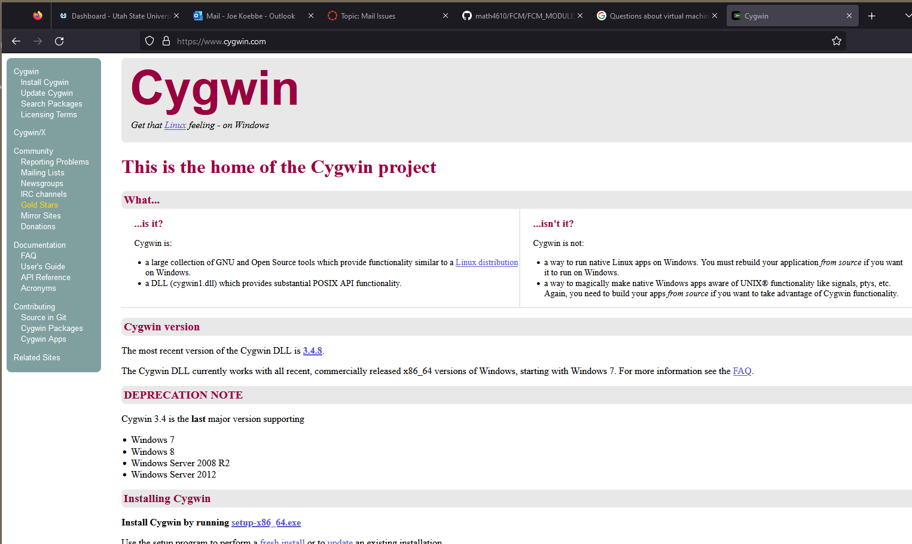

Then move on to the next step to download the set up script.

##### Step 2: Download Setup.exe 

When you get the main page for [Cygwin](http://www.cygwin.org), there is a link for "Installing Cygwin". Click on the link setup-x86_64.exe. This will initiate a download of the setup file for Cygwin.

##### Step 3: Start the Installation:

When going through the installation of Cygwin, you should use the defaults to get most of the things you need. You can add lots more to Cygwin once the initial installation has been completed. There will more discussion of this in the next section. So click on the setup executable that is in you download folder.

This will start the installation and the dialogs will start appearing. The first is the usual "Do you want to let ...." appears. You can stop the installation if you decide you do not want to continue. If you click on "Yes" the next dialog will look like

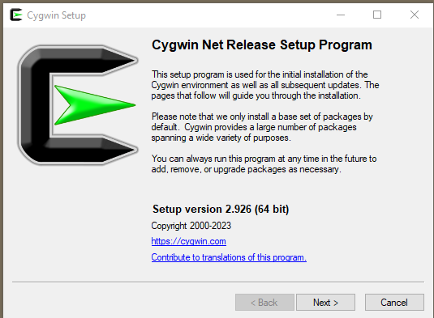

Click on Next to move on. Note that choosing Next on the rest of the prompts will install the default Cygwin distribution.

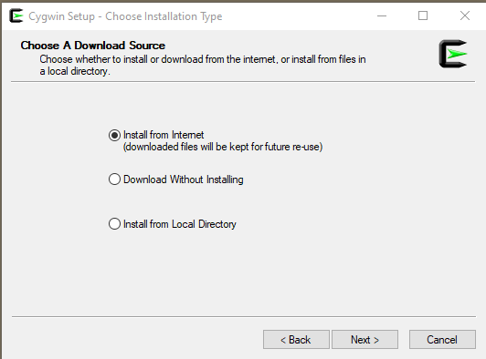

Next ... choose "Next>" to move on. The next prompt will be the for the root installation folder. The dialog will look like

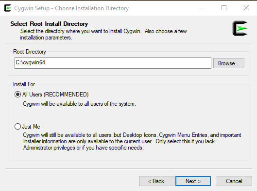

Click "Next>" to move on through the default installation. This results in a dialog like the following.

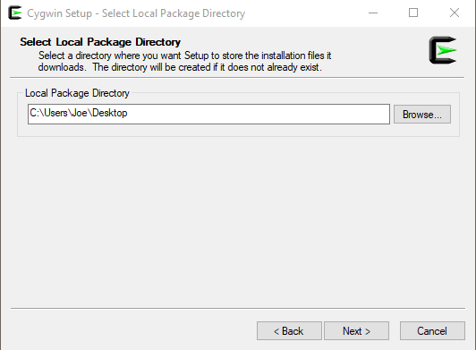

Again, clicking on "Next>" will move along through the default installation. The new dialog will look like the following. A brief dialog requiring no input will flash be and then the following dialog will ask for a location  to pick up the installation and modifications we will do.

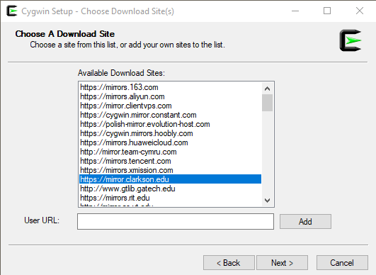

The site chosen is one that has worked well for the instructor of the course. Now, click "Next>" again. The setup program will work through the info so far and a dialog will  popup for a second or two with a  progress bar giving you information about what is going on. The default installation will then popup a table of packages to install. 

**IMPORTANT NOTE** Do not start with the Full distribution unless you have a lot of disk space and a lot of  time and patience. You can always add packages to the distribution in Cygwin. There is an example in the last section of this module.

So, we see something like

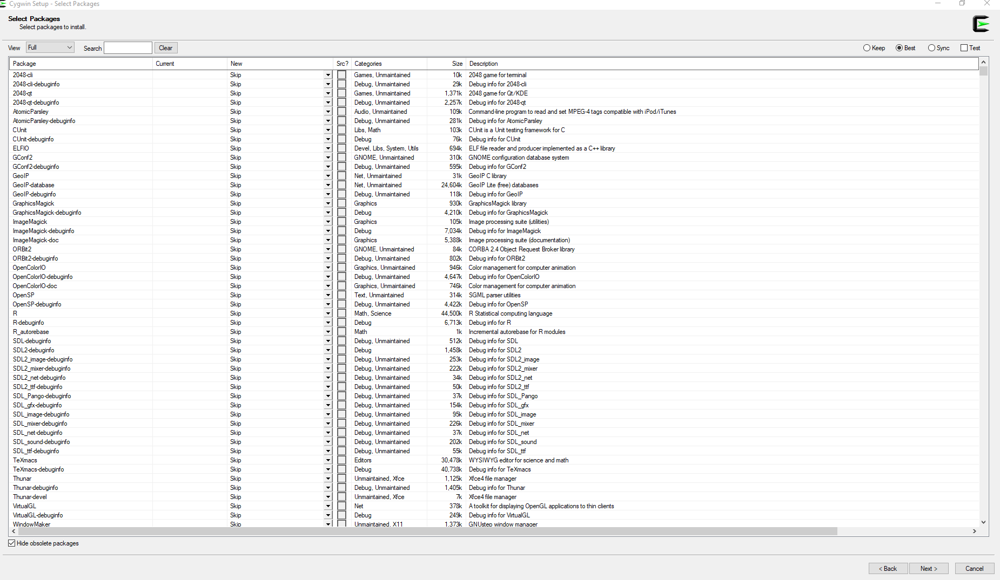

We are almost to the last dialog. Clicking  on "Next>"

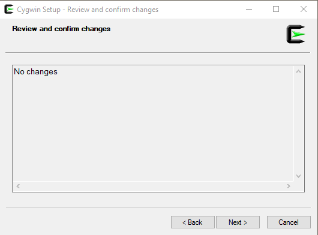

Finally, a dialog will popup to see if a couple icons can be created. That will actually help us get to a terminal and a way to work with a Linux OS.

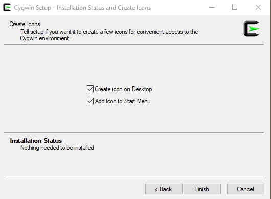

Click on "Finish" to complete the installation. You are done. If you have clicked the check box(es) you will have a couple of ways to a terminal.

### Bringing Up a Cygwin Terminal.

If you installed the icons that are included in the last step of installation, the following icon should appear somewhere on your desktop.

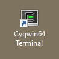

Double clicking on the icon will open a terminal, which is what we want. So we see a window that looks like the following.

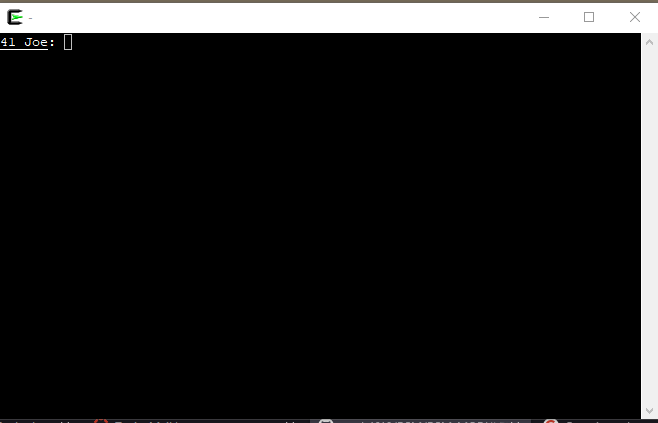

Note that once this is done, we  can get at a version of Ubuntu Linux that will allow us some serious control over both the Cygwin environment and Windows at the same time. For now we can test our knowledge of the OS.

###  Updating the Cygwin Distribution

To add packages or modify/upgrade packages in Cygwin, you can run the setup_x86_64.exe again. In fact, you can rerun the setup program as many times as you want. The software underlying Cygwin is being modified continuously. So, rerunning the setup program every week or so is a good idea. If makes getting the latest revision of the software relatively easy.

All you need to do is click on every default and when the table of packages shows up, one of two things will happen. Either there will be a list of packages that need updating or the table will show no entries. In the first case, the, clicking on "Next" and "Finish" will complete the update. If there is nothing to update, you do the same thing with no package updates.

The following is a very specific example of how to include a package in Cygwin. 

### Installing Packages Not in the Default Installation.

If there are packages that are not installed automatically by Cygwin, you can  use the setup program to identify all of the software you need for the additional installation along with completing the installation of the software. An example of the process of installing another package, the following window shows the step just before the installation starts.

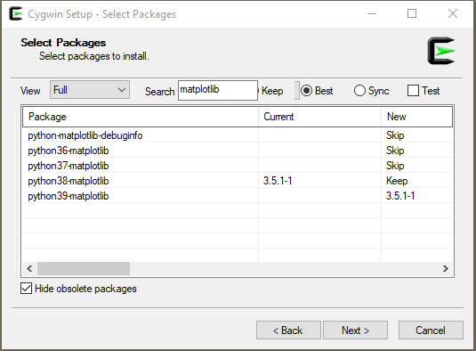

The effort in this case is to install a package, python.39-matplotlib, to work with in the Cygwin environment. All you need to do is to click on the "Next>" button to move on. The setup app should be run occasionally to make sure the latest updates to the Cygwin environment. 

### A Few Remarks

* Every once in awhile you should download the latest version of the setup executable. Changes to this executable are less frequent than the packages. So this will not be a lot of additional work to maintain the Cygwin environment.
* The packages related to latex, including executables, style files, and fonts can be loaded into the Cygwin environment. Notice in the following screen shot that the View is "Full" meaning that this out of all possible packages. In the Search field the string "latex" has been entered. So, the interface will list only the packages that have "latex" in the package name. The rest of the work is in determining what the correct package is. The Search file can be used to narrow down what you really need. Note also that the size of the download is pretty large if the fonts are all  installed. 
* When trying to install packages you want, it is a good idea to  find what  you really need before you let the modified installation start up.
* If things really mess up it is very easy to start over by getting rid of some folders. However, it will take a bit of time to get there.

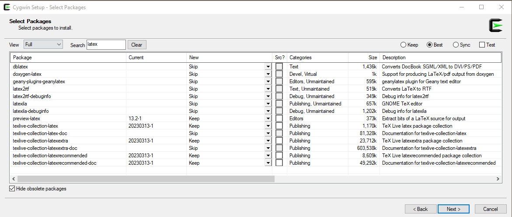

### Programming Example: Edit, Compile, Run, Repeat

In this section we will write a simple program in a terminal using a text editor called, vim, compile the code in the file using an appropriate compiler (c, gfortran, or java), and then attempt to execute the program. Before this, we will need to agree on a shell that will be used for the work.

> **Definition** In the realm of computers, a shell is a computer program that
> allows a person to access services provided by an operating system. A computer
> user can use a command line interface that will take commands from a user and
> translate these into responses that effect the state of the computer. It is called a
> shell.

We will be able to use any of the commands available in a shell to change what the machine creates, modifies, kills, and so on. In the next example, we will write a small program to show how to use a terminal in the process. Let's program up the infamous "hello world" example in the C-programming language. We will do this over a few steps and we will use several commands that Cygwin has available. The commands we will use are:

1.  **tcsh** - this is a shell that is available in Cygwin, although may have to install the package using the process discussed above. Note that the most common starting point for a terminal is **bash**. The instructor in the class has opted into **tcsh** due to learning C at the same time and these two behave similarly.
2.  **vim** - this is a terminal based editor and is a bit cryptic. However, this usually available on any Linux/Unix computer.
3.  "gcc" - this is a C compiler that can be used to compile a text file into an executable.
4.  If the compilation set is successful, an executable/command will be produced in the process. This command will be excuted.

##### Launch a Terminal to Work in

If you have Cygwin installed, you should be able to start by double clicking on the Cygwin icon as before. The following terminal should appear.

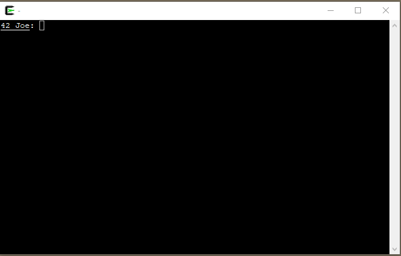

Then move to the next step.

##### Step 1. Make sure the commands are installed.

The programs we will need are the following:

* tcsh - the shell to use in the example,

* vim - the text file editor

* gcc

The end command will combine these commands. To test if the commands are available enter the commands as shown in the next figure.

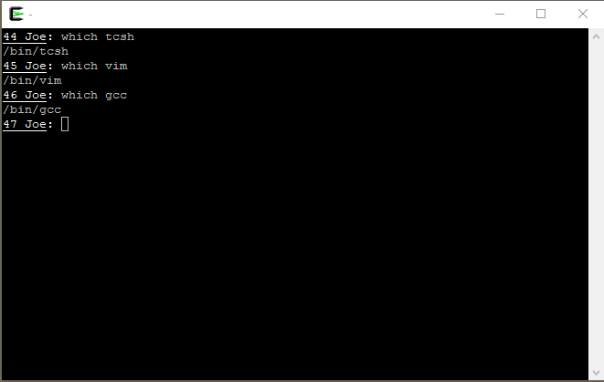

If no warnings errors occur about "command not found." you can move to the next step. If the commands generate a warning or error, you will need to go back to the setup program to install.

Let's assume that the **tcsh** command is not available. Then, run the Cygwin to the table showing the packages. From this, select Full in the drop down menu and Search for "tcsh". If all goes well the following will appear  in your installation setup sequence.

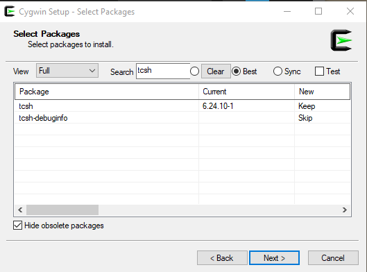

In this case, the tcsh package has been installed. So there should be no problems with the command.

Note that you may need to do this with both **vim** and **gcc** commands to finish this off. However, if the **which** command is not producing warnings we can move on.

##### Step 2. Editing the Text File

Now we need to create the program file. The next command is to invoke the editor, **vim**. This can be seen in a terminal as follow.

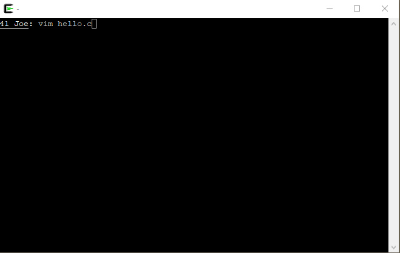

The result is a terminal that looks like the following:

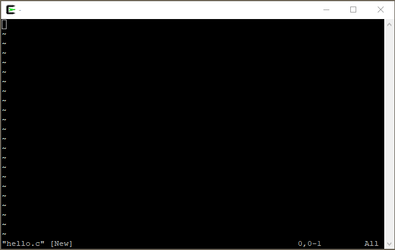

At this point  you see a blank file and a line along the bottom indicating that the file is [New] and the name of the file is "hello.c". To create the file, you can type a lower case "a" to add text to the file.  and add the text so that the terminal looks like the following.

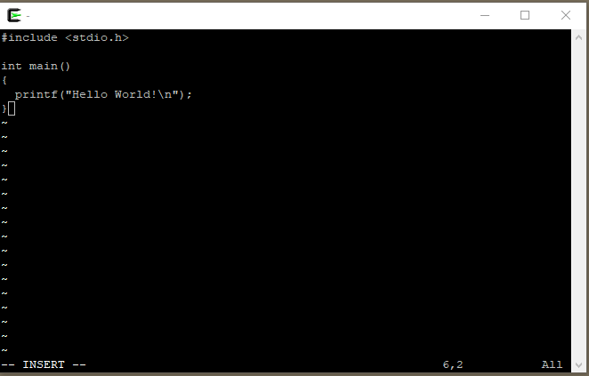

When you type the "a" at the beginning the editor is put into an append mode which will append characters as are typed at the key board. When there is a new line, you can type a "return/enter" to move to the next line. If you get the window to look exactly like above, type and ESC  on the terminal and you will be taken out of append ode. The window should look like

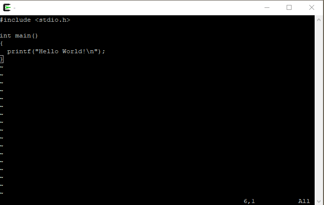

Once the file is no longer in append mode, you can type a ":x" to exit the editor and save your work. The terminal will look like

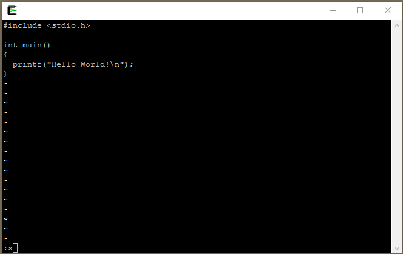
and then the terminal will look like the following.

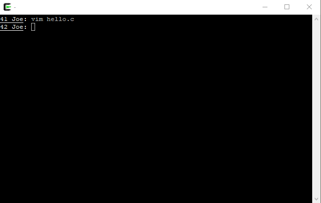

If all has gone smoothly, the text file, "hello.c" should be in folder. You can use the **ls** command at the prompt to see this. We are ready to move on to the next step.

##### Step 3. Compiling the Program.

If we have made sure that **gcc** is installed, we are ready to compile. To create a simple executable, make the terminal look like the following and hit Enter to execute the command. The terminal will look like the following.

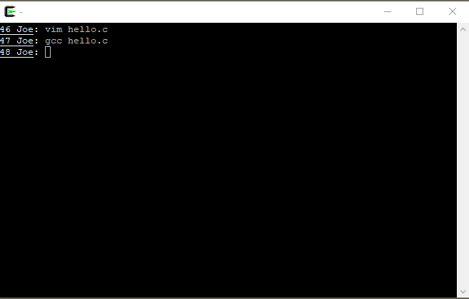

If there are no errors and the like, we are ready to execute the executable version of the program we have created.  If no name is given to the executable file, the default name is **a.exe** or sometimes **a.out** depending on your computer. After you type in the command **a.exe** at the command prompt the final display will be the following terminal.

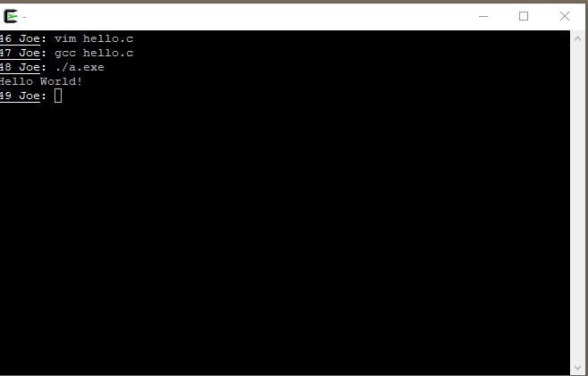

We are done with the example and have created a text file to encode our program, compiled the program, and then executed the program to see some output from a computer.

### Summary: 

Cygwin can be use as a powerful computer platform. There are a lot of pros and cons to this. However, if you need a terminal for testing what you are doing on a Windows box and you need flexibility, Cygwin is one way to go.

##### Questions and  Problems.

**Question 1** How does Cygwin differ from other Linux/Unix operating systems?

**Question 2** What are the two main shell scripting environments?

**Question 3** Write, compiler and run a "Hello World!" application in Python and use the python interpreter to run your code.

##### References:

* [Wikipedia](https://en.wikipedia.org/wiki/Shell_(computing)) definition of an operating system shell with explanations.
* [Introduction to Cygwin](https://www.geeksforgeeks.org/how-to-use-linux-commands-in-windows-with-cygwin/)