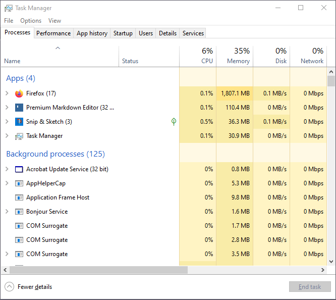
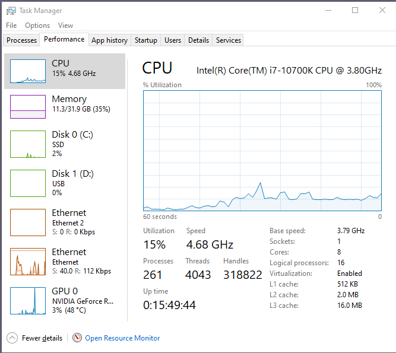
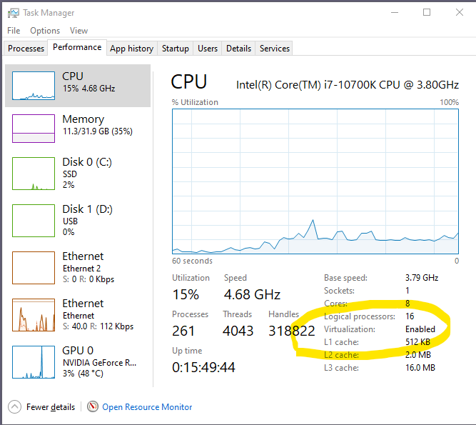
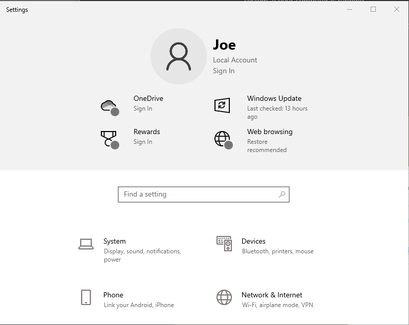
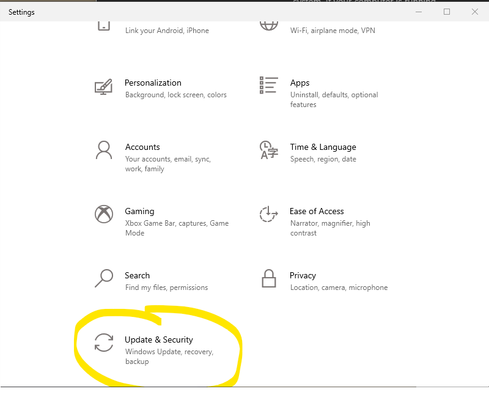
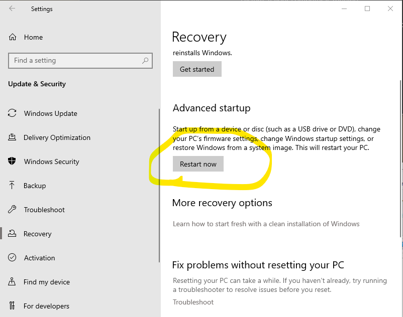
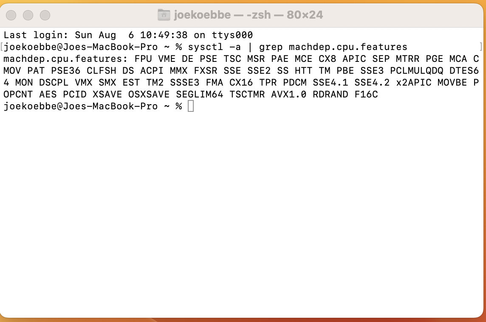

## Hardware Virtualization in Scientific Computing

Virtualization is a technology, in the form of software, used to set up simulated virtual versions of computer hardware/resources on top of an existing physical computer. This may include emulation of operating systems, memory, storage, CPUs and so on. The end product of applying virtualization is a standalone virtual computer or multiple  virtual computers all running on a single physical computer or server. Each of these machines can run asynchronously relative to the physical computer and any other virtual computers that have been deployed. To generate multiple virtual computers, the resources on a single physical computer are divided amongst the given number of virtual machines and the host computer in a way that allows all of the machines to do some amount of work independently. 

Real world problems have become more complicated over the past several decades.
Simulation of physical processes like weather, ocean current, and orbits of all kinds of cosmic masses are always in need of more computational resources. The computer hardware to solve the resulting mathematical problems necessarily must increase along with the size of the problem. Most software developers do not have direct access to massive physical hardware resources needed to provide adequate solutions. However a programmer can buy or rent access to resources through companies like Amazon and VMware. For the material in this course, we will only need to generate one or two virtual machines to complete our tasks. By the end of the course, students will be able to work with resources like AWS and VMware with ease. Note that computational resources through AWS or VMware will cost you a bit of money.  Students will not need to purchase or rent time. Instead, we will use free software to generate virtual machines.

In the lesson on [Virtual Machines](../FCM_VIRTUAL_MACHINE/) , we will see one such product. We will use VirtualBox from Oracle - more on this in the near future. VirtualBox is a free piece of software provided by [Oracle](www.oracle.com). There are a couple of things we will need to do before moving on to the instantiation of a VM.

Before we actually do anything too crazy, some of the features of virtualization are described.

**All the features any developer wants:**

1. You do not need to be in the same location as the physical hardware you are using.
2. Virtualization abstracts the physical hardware functionality into software that can be run anywhere there is an internet hook-up.
3. If hardware is purchased to handle different tasks and the hardware is under utilized, the maintenance costs maybe too burdensome. If virtualization is used, one server can be used to replace a number of servers. The work can be distributed on virtual resources.
4. If virtualization is used, any number of physical machines and configurations can be managed through a single physical server or time can be purchased on hardware at a remote site and/or from a company that does the physical maintenance.
5. Think of developing software that needs to read in data in one stream, processing the data on another machine, and graphically displaying results on another computer. We can choose a configuration for each of the pieces and then use a single source for the hardware - on the internet or on a local server for less cost.
6. Using virtualization allows for more robust testing of software. If software is failing and causing problems with a computer, virtualization avoids the catastrophic failure of your computer. The virtual version of the computer resources can be deleted at no cost to the physical hardware.
7. Buy time on cloud computing and allow the vendor (AWS or Google) to maintain and purchase the physical hardware.
8. The use of multiple physical servers involves using more electricity than a single server. This gives developers the opportunity to optimize energy costs by efficiently using all hardware resources.
9. Increasing the size of the memory becomes a lot easier and the size of problems that can be solved on virtualized resources.
10. Kernel-based Virtual Machines provide digitally separated environments switch between available OS's without any rebooting necessary.
11. A VM is a software-defined computer. So it is easy to activate the computer or copies and clones of the computer  we want to use.
12. You  can create deployment and configuration programs to define a template VM. All of the VMs generated are the same/consistent and easier to maintain.
13. Recovery from natural disaster and cyberattacks is quick and easy.
14. On the end-user side of things, business consistency and resiliency are easier to maintain.
15. Install apps and software packages on as desired without affecting the rest of your users/developers.
16. Server virtualization is a process that partitions a physical server into a multiple virtual server - without server virtualization, physical servers use only a small amount of their processing capacities leaving devices idle.
17. Storage virtualization combines functions of physical storage such as NAS and SAN device - you can combine multiple storage devices virtually into a single storage device.
18. Network virtualization applies to how networks at various locations can be combined together.
19. Data virtualization pulls out the functions of applications to run on different OS's.

**Terms To Know**

  * Virtual Machine (VM)
  * Hypervisor
      * Type 1 hypervisor - bare-metal hypervisor - enterprise computing.
      * Type 2 hypervisor - end-user computing.
  * Host computer - Physical computer.
  * Guest machine - Computer installed on top of another computer.

###  Onward with Digital Virtualization

So, virtualization is an important concept. Most newer computers have the necessary resources to instantiate multiple virtual machines. The first step is to determine if the computer you are using allows hardware virtualization. If hardware virtualization is available, then we will need to make sure that your computer has hardware virtualization enabled. Not all computer vendors enable hardware virtualization as a factory default setting.

Note that you will only need to make a change one time if needed. You will not need to do this more than once on each computer you use and you can always undo this change in the CPU configuration  on your computer. So, let's start with a quick check to see if your computer has hardware virtualization enabled and if not, is it possible to enable hardware virtualization on the computer on which you will be working. 

##### Hardware Virtualization on Windows Machines

There are a couple of ways to enable hardware virtualization on a Windows box. The following steps assume you are working on machine running either Windows 10 or Windows 11. The steps are the same for both.

##### Determining if Virtualization is Enabled

Perform the following steps:

* Open the Task Manager by using the Ctrl+Shist+Esc-key sequence. This will open the Task Manager with more details than the usual method for invoking the Task Manager. The following screen shot shows what should show up on your screen.



*  Click on the Performance tab in the window that pops up. This will get us closer to what is needed. The  information in the Performance tab will provide us with more information about your computer. The information displayed will help understand how resources are being used and what is available for other processes we may want to run and use.



*  Click on the CPU entry, and look to see if **Virtualization:  Enabled**. In the example displayed on the screen, you can see that virtualization is enabled and we can move on.



If there is no information, virtualization is not enabled or is not possible on the computer you are using. If the results show that virtualization is disabled, we will need to flip a flag to enable virtualization. The steps below will get you there.

##### BIOS Setting Steps for Enabling Hardware Virtualization

Modifications to the BIOS can be a bit tricky and cause some people to cringe a bit in changing these settings. So, you will need to be careful when following the steps. There is a usually a way to recover when modifying the BIOS, but since we are only changing one setting, you should be ok with this. If not, there is another way given below.
*  If your computer is already on, you will need to restart the computer. As soon as the machine is restarting, start tapping rapidly on the appropriate key to enter into the boot menu or BIOS setting menu. On some computers this will be the ESC-key on others it may be F2-key or F4-key depending on the maker of the computer. On the authors laptop and Desktop, the BIOS setting escape key is the F2-Key.
*   If the BIOS settings menu does not show up **and** the computer continues to boot up into Windows 10 (or Windows 11) repeat the previous step until it works or try the next section for a different method. Sometimes this just requires typing the ESC-key even faster.
*   Once the BIOS menu is on your screen,  locate the CPU configuration menu. This will not be the same for all computers. So, you may need to click on some menus before seeing the correct item in a menu - see the description in the next step.
*   Next find the setting for Virtualization. This may not be in the same location from one computer to the next. However, it will be there somewhere on most new computers.
*   If Hardware Virtualization is disabled, select the Option for enabling Hardware Virtualization - usually a toggle between disabled and enabled.
*   Save the changes that have been made to the BIOS setting.
*   Finally, Exit the BIOS settings menu. and reboot the computer to have the changes take effect.

In some implementations, you can do the save and exit in one step. When you have clicked on the "Exit" option or "Save and Exit" option the computer should boot up in the OS and behave pretty much as usual. You can check to see if the change worked by opening the Task Manager again and checking the CPU performance.

Since this process is carried out before any real applications are available, there are no pictures in this case. However, we will see how to get a screen shot of some of the operations once we have a virtual machine up an running - more on that a bit later.

##### Enable Hardware Virtualization Directly in the Settings Control Panel

For Windows 10 and 11 boxes there is a little easier way to get into the BIOS on your system. If your computer is running,

* Click on the Start menu on your desktop and click on the Setup icon.



* Click on the "Update & Security" link



* Click on the "Restart now" button in the "Advanced restart" are of the dialog that pops up.

 
 
At this point the computer should start through a reboot to the BIOS settings menu. From that point on the steps from the previous method can be used. You will need to find the virtualization enable/disable toggle just like before and then "Save and Exit" to reboot and start working.

#####  Hardware Virtualization on MacOS

Unless you are extremely unlucky in your MacOS life, hardware virtualization will be enabled on your Macintosh/Apple computer.  To see if your Mac is one of the many that already have hardware virtualization enabled, do the following.

*  Open a terminal by clicking on the terminal app on the desktop. Note that on the Macbook Pro used by the instructor, a link to a terminal appears on the Dock (or the Launchpad).
*  At the prompt in the command terminal, type  the command
   ```
     sysctl -a | grep machdep.cpu.features
   ```


* The output from the previous command should look like a rather long list of cryptic characters that indicate various states of things on your apple computer.
  
If you parse through the  output there is a three character output, "VMX". This indicates that hardware virtualization is available on the Mac computer being used. If virtualization still needs to be enabled, you can start with the following approach.

* To enable hardware virtualization, you should run Software Update from Apple. The update may clear up a firmware  upgrade for the CPU on our Apple computer.

If this still does not do the trick, see your instructor to make sure virtualization is enabled and available for the next content on virtual computers.

##### Questions and Problems:

**Question 1** Verify that the computer you are using for the class is able to handle hardware virtualization. Along with the apps/commands needed to determine whether or not hardware virtualization is enabled, include a screenshot that shows the computer is hardware virtualization enabled. Use something like Snip&Sketch or the equivalent Apple screen shot app.

**Question 2** Read the article at the link:

[Cloud Computing](https://aws.amazon.com/what-is/virtualization)

and write a few sentences about the downside of running virtual  computers on your laptop or desktop. Do not use ChatGPT or other AI application. After writing your answer to this question,  run a request into ChatGPT to see what the bot finds. Compare your answer to the response from ChatGPT.

**Question 3** Provide a screen shot of the resources available on your physical computer. How many cores, speed, and so on. You can find the information in the About tab in the Updates and Security section on the computer. Use a screen shot of the popup window.

##### References:

* [How to enable Intes VT-x virtualization feature in Max computer](https://kb.parallels.com/en/5653)
* [Oracle](www.oracle.com).
* Put in the YouTube reference for the VM
* [Cloud Computing](https://aws.amazon.com/what-is/virtualization)