#  Deploying Virtual Machines (VMs)

In testing ideas in computational science it would be nice to be able to install a piece of code being tested onto a completely different computer possibly using a different operating system (OS). In that case, you would need a computer for editing and maybe compiling the code and another used as a guinea pig machine (GPM) in case something goes horribly wrong. The development of projects using this approach might require repairing your GPM every time you run into a significant problem. In addition, purchasing and maintaining two physical computers while reinstalling an operating system (OS) multiple times. The time and cost may be prohibitive in terms of development deadlines and/or one's bank account for software developers.

Fortunately, hardware virtualization and virtual machines (VMs) provide a more cost effective means for developers. The creation of a virtual machine produces a fully functional computer on top of the existing hardware on your current physical computer. The resulting VM acts exactly like a computer off the shell running any OS we want installed on the VM. This allows developers to work on a variety of configurations without buying more physical hardware. This is the idea behind Cloud Computing.

VMs can also be  used to apply virtualization on hardware like storage devices and networks. For this course we will be installing software that will manage VMs that we create. In turn we will use the VM we create to test ideas related to our work on scientific computing.

### What is a virtual machine (VM)?

A VM is basically an application or app that runs on a computer that thinks it is a fully functioning, standalone computer that is independent of the physical computer you work with every day. It is best to have a few definitions to start. So let's delineate between the physical and virtual machines we will create and use for work on problems during the course.

> **Definition:** The physical computer will be referred to as the host computer or 
> host machine and the default operating system on the host computer is referred 
> to as the host operating system (HOS). This will typically be the operating system 
> that boots up your computer for your day to day work.

Any physical computer has resources like one or more CPUs, disc drives, memory, cache, and other real parts of the computer that you can reach, touch, upgrade, replace, and monitor. The way we use any of the resources on a laptop or desktop computer is through the OS which is installed on the computer. Note that the HOS may be Linux, Windows, or MacOS. Most modern OS's support the use of VMs. What we need is a way to create VMs. This includes a way to specify the resources we will need to build a fully functioning (virtual/fake) computer,  develop apps, and use the created VM to test the work we are doing.

The first step towards successfully deploying a VM is to install a user interface (UI) that will do a lot of the work on our behalf.

> **Definition:** A Hypervisor is software that can be installed on a computer to 
> create and manage VMs on a host computer. A Type 1 Hypervisor is installed 
> directly on the hardware (bare metal hypervisor) of a computer and in place of the
> (possibly) existing OS. This is used in place of the OS on the  physical computer.
> This type of Hypervisor allows the hardware to deploy VM's. A Type 2 Hypervisor
> is used to install VM's on top of the HOS.

The advantage is that you can use a VM to perform tasks asynchronously from the host computer. Using a Type 1 Hypervisor in an enterprise setting is common in computing. This allows a "VM on demand" approach to computing resources people need. If you have an interest in Information Technology (IT) VM computing is something you will need to master. Virtual computing resources like VMware and AWS are examples of publicly available pay as you go virtual machines that can be used by developers.

Before we build our first VM, we need a couple of things done to be to be able to create a VM.

### Things needed before installation of a Hypervisor.

Before the creation of VMs can begin, we will need to make sure that the physical hardware can handle the additional workload. When a VM is created, a portion of the physical hardware must be made available to the VM for it's dedicated use. This means hardware, storage, and other resources. One way to ensure that your computer has enough stuff is to find the information about your computer as follows:

* Open the Settings window to display the following and click on the System link.

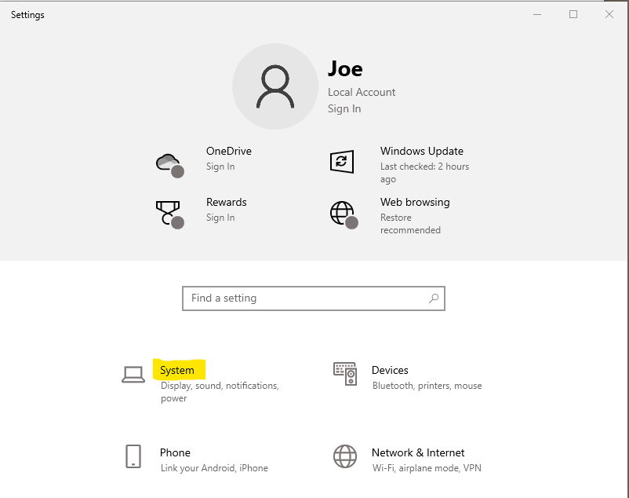

* Next, scroll to the bottom of the links on the left hand side and and click on the About link as shown below. The information needed is in the window that pops up on your screen.

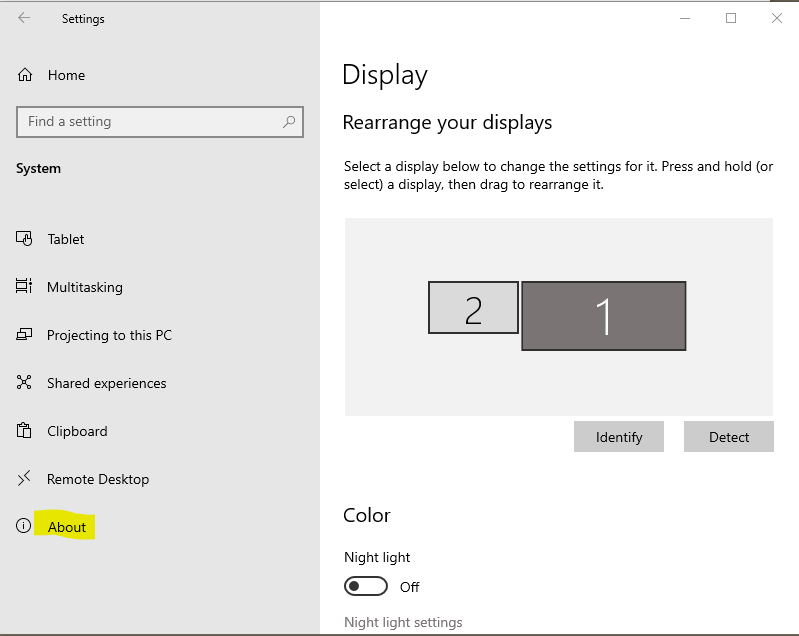

* The OS information (64-bit) and memory available are both shown in the right hand side container of the window.  In this example, the computer has 32BG of memory. We need to go down a bit more to find out the number of cores available.

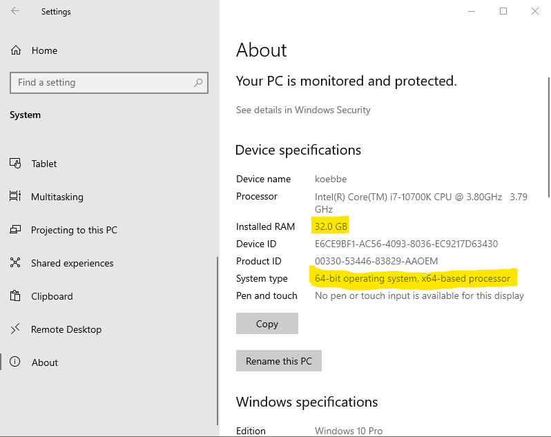

* To figure out the number of cores, you can scroll down on the right container in the window shown above and open the device manager by clicking on the link as shown below.
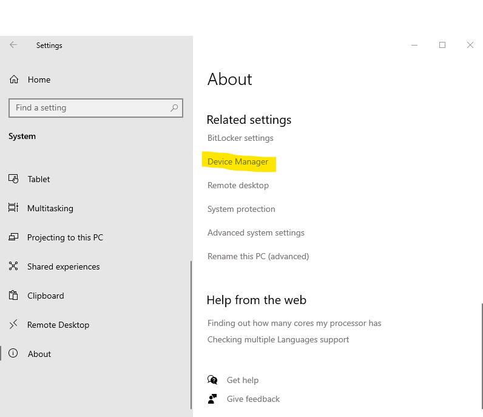

* The device manager will popup. You will need to expand the list of processors by clicking on the Processor heading as shown.

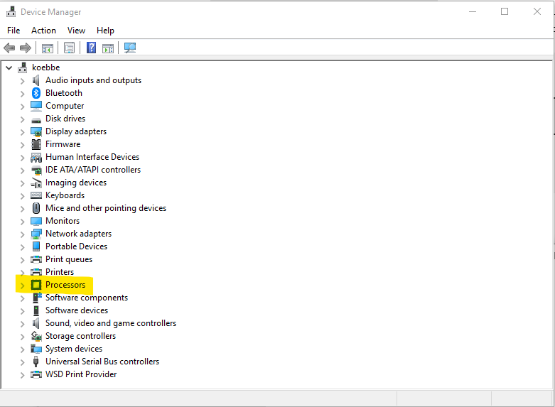

* The final step is to count up the  number of cores that you have available on the computer. The expanded menu in the Device Manager should look like the following.

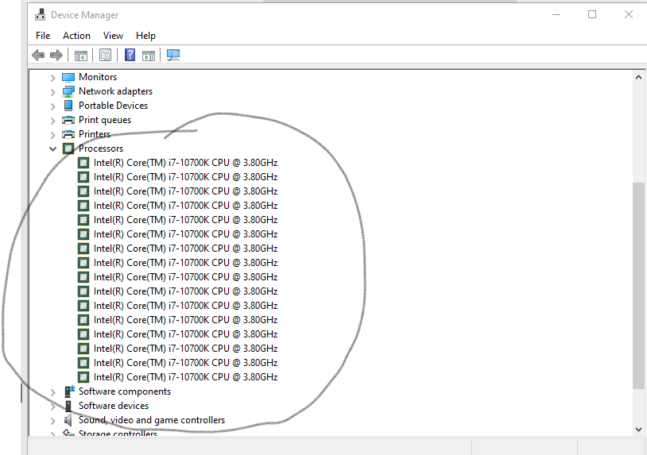

So, it appears that the computer in this example will have 16 cores. Note that the actual physical number of cores on the machine is one half the total number

You will need to make sure that your computer supports digital virtualization and if so, is virtualization enabled on your computer. If virtualization has not been enabled, this will need to be done.

Note that it might make sense to build a VM that has 4 cores assigned with 8GB of memory to run a simulation while you are streaming video or doing other tasks on the rest of the resources on your computer.

##### Step 0. Enable Hardware Virtualization Support in BIOS

Note that in the previous [lesson on virtualization](../FCM_VIRTUALIZATION/) , we already completed this step. If you have not completed the check and enabling of virtualization, you should go back and do this now. A brief version of the steps to take care of hardware virtualization issues follows. If you have completed the steps below, you can skip to the next section of the lesson.

##### A Brief Review of How to Enable Hardware Virtualization. 

Note that if you are using on 32 bit apps, the following steps are not necessary. If you intend to use 64-bit apps and such you will need to enable virtualization. Most scientific computing application are run in a 64-bit setting to guarantee the accuracy of the many, many calculations needed to approximate the solution of mathematical problems.

**The Steps to Enable Virtualization**

* Restart your computer
* toggle F2 or the boot escape character to get into your computer settings.
* Once in the select boot device pops up, select Enter Setup
* go to advanced settings
* determine which setting has to do with the Intel (VMX) Virtualization Technology or equivalent for other vendors.
* If disabled, enable.

To finish, restart your computer from the setup menu.

Each of these steps is likely to depend on the computer vendor who provides the CPU on your computer.

### What are the benefits of using Virtual Machines?

The following examples present a few different situations where the deployment of a VM or multiple VMs may be helpful. You can probably think of number of reasons in your computational experience.

### Learning a new OS

There are a lot of good reasons to learn a new OS. These may include a job requirement or potential job requirement or to use in data science applications. It may be the case that you just want to expand your knowledge base and skill set. Using VM's allows one to install Windows OS, Linux varieties like Debian and Ubuntu and any number of variants. The advantage is that you can create a completely detached computer from your HOS to learn and work from. If something goes wrong, you can just stop the VM and start from scratch with a new VM. Or scuttle what you were doing by deleting or destroy the VM and build a new VM from the ashes.

### Testing ideas without risking damage to the host system.

Developers will eventually run into projects that will require the use of lots of resources or involve a code that can damage file systems and such. It makes sense that the testing could be done asynchronously in a VM without risking your hardware as you work on problem difficult problems. Think about a mail handler that could potentially wipe out or corrupt your entire mail account. Doing so on a live system could be disastrous for a company or business. Hopefully, a competent IT person would have the sense to at least make a full verified backup to restore any lost files. However, using VMs will also help.

### Performing calculations in parallel to host machine activities.

If the work you do involves large scale systems and still need to work on your HOS. Set up a virtual machine to do the computations behind the scenes. This allows a user to monitor the progress of simulations and still complete other work with dedicated resources. Another application may just need the ability to submit jobs to a High Performance Computing (HPC) center that allows access through submission of jobs to a queue. You might consider using a VM to monitor the simulations as they run.

### What is the down side of working on a VM?

Splitting resources can cause issues. Memory and  processors must be allocated and that comes out of physical memory and disk space. VM resources are not available once the VM gets going. To keep your work going on a VM, you will need to put save the configuration before shutting down your computer. If the configuration of the machine is not saved you may lose work. The nice thing is that most Hypervisors will have management tools to take care of these issues.

## Step by Step VMs

The following steps can be used to generate a VM:

### Assumptions:

The steps given make the following assumptions:

* We will start with a Windows OS - in particular the HOS will be Windows 10 or Windows 11.
* The Hypervisor in the example is VirtualBox - this is freely available from Oracle.
* The example will create a VM running Ubuntu Linux - Ubuntu  will be used throughout the course to develop  applications for solving problems in computational science.

##### Step 1: Install A Hypervisor.

Since free is better than not free, this course will focus on Virtual Box by Oracle. Most software on the internet comes with some work of set up file. Virtual Box is no different. Open your favorite browser and navigate to Oracle's download page for Virtual Box. Note that VirtualBox is a Type-2 Hypervisor. This matches what we would like to do.

To get a copy of VirtualBox, visit the following site.

[Virtual Box Download](https://www.virtualbox.org/wiki/Downloads)

Click on the link to the appropriate host. In the case of this example, that will be Windows hosts. This will download an executable setup application. Click on the setup file. Note that if you using a MacOS on your computer, the appropriate type is macOS / Intel hosts. A screen shot of the two host types circled is shown below.

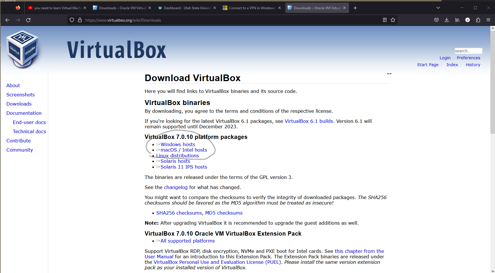

You will need this to download the software.

##### Step 2: Install the Software:

After the download of the setup.exe file is complete, you can click on the executable in your downloads or make a copy on your desktop. Once the setup.exe is running you will asked if you want to let the software change your system. Click on the Yes button to keep going with the installation. The installation is like a lot of other installations on Windows. You can basically click on the Next link a few times and the installation will proceed with little in the way of issues. When al is well and done, there is one additional step.

##### Step 3. Install the Extension Pack for the Software.

There is an extension pack that you will need to install. If you back to the main [download site](https://www.virtualbox.org/wiki/Downloads) and scroll down until you find the header

    Virtual x.x.x Oracle VM VirtualBox Extension Pack
    
and then click on the link just below the header. This is needed to add some more functionality to the virtual machines being created. Once the extension pack has been downloaded, start up the application to see the following window.

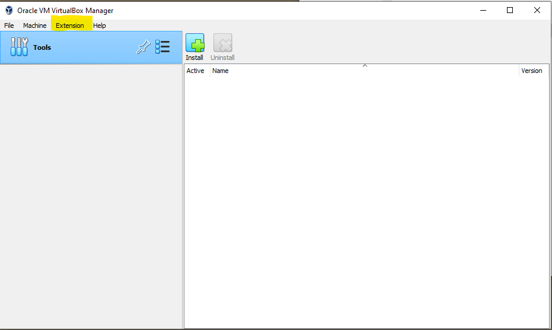

Click on the Extension menu item that appears in the VirtualBox User Interface (UI). The result will be a menu of choices to install or uninstall extension packs.

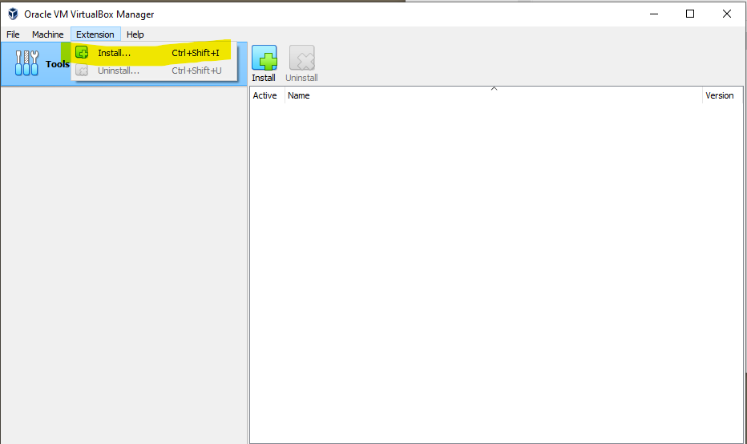

The work to install the needed extension pack execute with little fan fare. When the installation of the extension pack, the extension pack will be in a list of things that are included. To see this, click on the menu of tools in the UI (see the figure below).

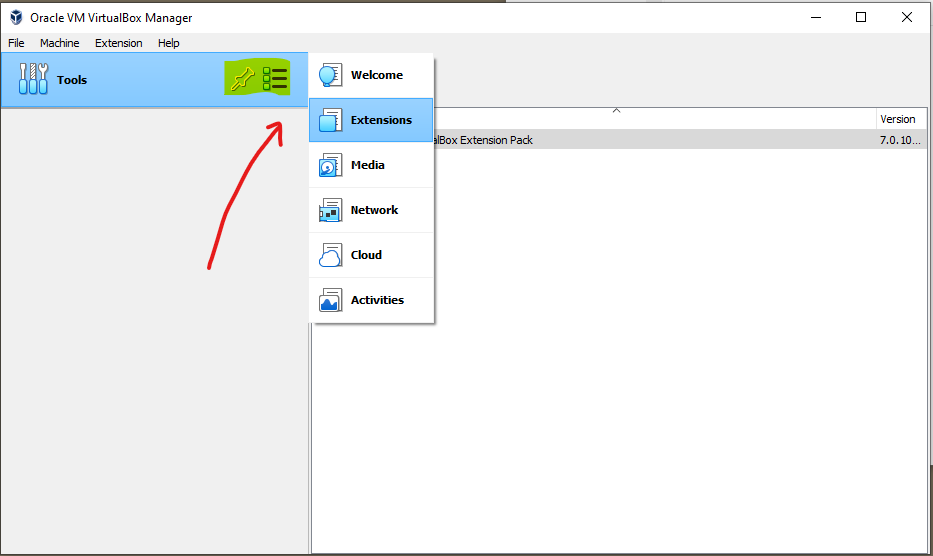

We will need to do a bit more work to get a VM running.

##### Step 4. Getting the OS that we want:

We will want to install some OS to run the VM. In this example, the choice of operating system will be publicly available Ubuntu Linux. To do this we will download a file for some version of Ubuntu Linux. The link used to get the file is the following:

[Ubuntu Downloads](https://ubuntu.com/download/desktop)

Scroll down to a point where the download link to Download xx.xx.x. In our example, the version downloaded is 22.04.3. Note that the download file is large and will take a bit of time to download. If you are worried about the file downloaded, there is a checksum you can run. As a lesson in how to do computer modifications we will see how to do the checksum.

Once the download starts the browser will display a thank you page with check sum instruction. Click on the "verify your download" as shown below.

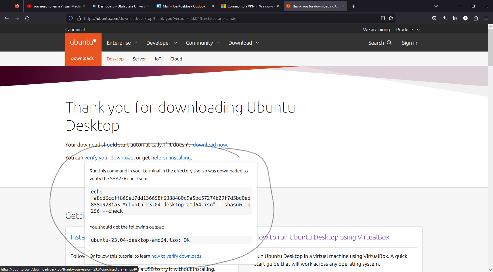

To test, the command listed above can be entered into a terminal in the folder where the file is located. You won't know how to get to the terminal until a later lesson. However, if the terminal is up and running, the result of the command is shown in the following figure.

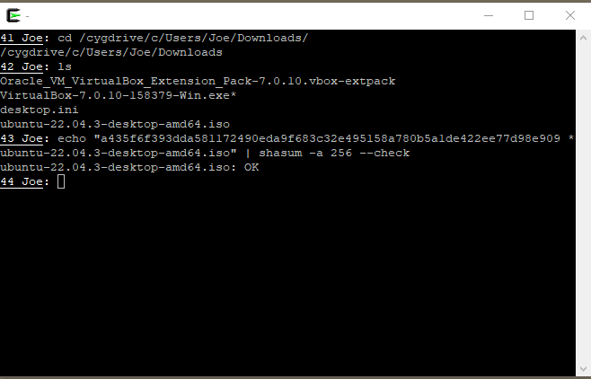

The output from the command indicates that the check sum is correct and the file is most likely ok. The last piece of this part of the process is to locate the file somewhere that is easy to find. In our case, the location will be in a folder on my Desktop.

##### Step 5. Building a first VM Running Ubuntu

Everything we need is now in place. Start the VirtualBox app by any of a number of ways. Start up the VirtualBox app. You should see a window like the following.

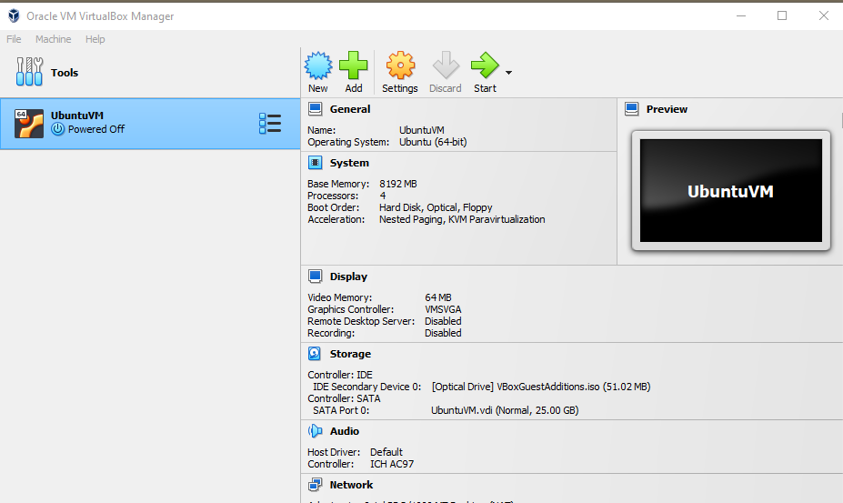

Next, click on the New button in the Tools bar. This is where the work starts in putting together a description of the VM. The result should look like the following.

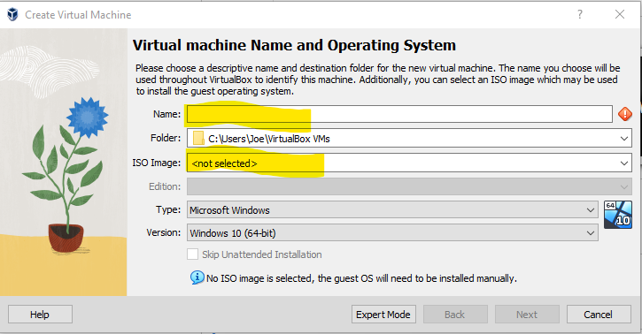

You will need to fill in the name of the machine you are creating. For example,

    ubuntunow
    
might work for the name. You do not need to pick the default folder where the VM details will be stored. You will need to set the ISO image to the location of the file downloaded above, say

    .../Desktop/Ubuntu22.04.3_dist/ubuntu-22.04.3-desktop-amd64.iso

Mostly, you can use the drop down arrow to locate the appropriate file. Now, click on the Next button to move on.

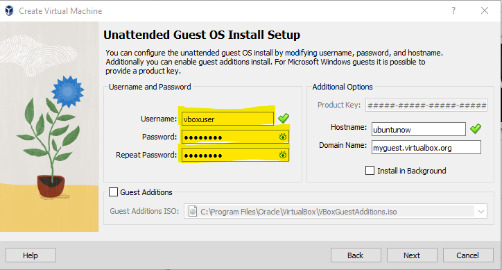

Note that if you leave the username as is, VirtualBox will use the username, but require administrative privilege to log in. It is suggested that when building a VM set a different username. Use a lower case letter to start your username. Otherwise, the setup will throw an error at you. Also, you should click the Guest Additions to make the installation work a bit better. Click the Next button to continue.

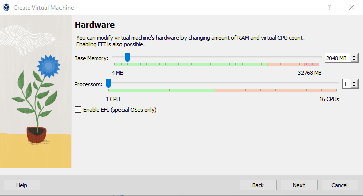

In the Hardware section above you will need to select the amount of memory and number of CPUs. This will depend on the machine you are using. On the machine used in this lesson, the total number of CPUs is 16. So, it would make sense to use 4 CPUs and for the 32GB of memory on the physical computer, it might make sense to use a setting like 8GB. Then click on Next to move on.

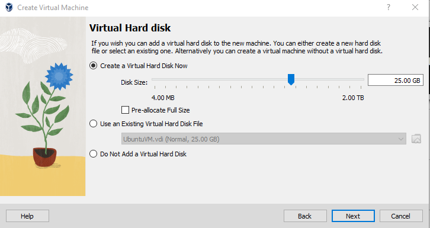

For a first VM, just click on the Next button on the window above to set up the 25GB of storage. A summary of the VM resources will then appear

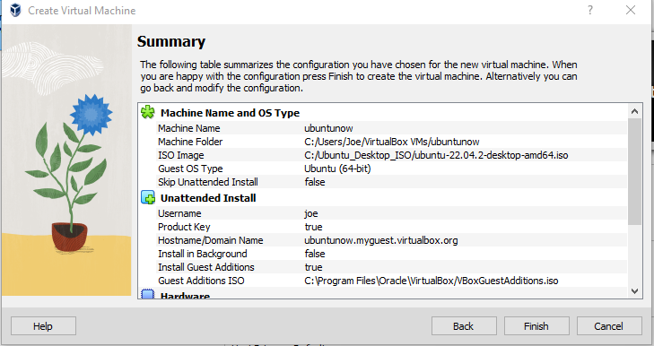

Clicking on the Finish button will create the VM. The whole process will rule in a popup that looks like the following. A VM should appear in the VirtualBox manager. From there, you can start and stop the VM and do a lot more. You should spend some time getting familiarized with the commands and features..

##### Some issues that may occur: 

* Installation: When you have everything set up and have clicked on the Finish button, it will take a bit of time (under 30 minutes) to install the software and create the VM. You should actually let things go at this point. In addition, the VM will also go through a reboot to get all of the features updated and the like.
* Username Issues: - In the installation process you will be asked to choose a user name. VirtualBox will balk if the first character in the password is not a lower case letter - not sure why, but this is the case. So, use "joe" and not "Joe" for a user name.

* Black Screen on restart of the VM. Need to increase the VM memory allocation.
  * power off the currently running VM using the x in the top right corner of the window
  * When the VM Manager displays, right click on the VM that was just powered down
  * click on the Settings menus item
  * the settings window will pop up and you will need to click on the Display menu item. This will popup a window that will allow you to set values for the memory and monitor preferences.
  * You should adjust the Video Memory up; say to more than 50MB
  * Click on OK
  * Start the VM to running again.

This worked for me. There is a reference to a YouTube video I found  that corrected this problem.

##### Questions and Problems:

**Question 1** Suppose you are running a Windows machine, but you have a program that needs to run in a Linux environment. How can you run the program while still technically using your Windows machine?

**Question 2** What is the difference between a native and a hosted virtual machine monitor (hypervisor)? 

**Question 3** What is the difference between a virtual machine and a virtual appliance?

**Question 4** What are the associated benefits of using virtualization software? Give a few examples of each benefit..

**Question 5** What is the difference between native and hosted virtual machine monitors?

**Question 6**  What are the three components of virtual machines?

**Question 7** What is the main purpose of virtual machines?

**Question 8** What creates virtual machines?

**Question 9** What are the benefits of using virtual machine?

**Question 10** Do virtual machines have different IP addresses?

**Question 11** What are the disadvantages of using a virtual machine?

**Question 12** What controls a virtual machine?

**Question 13** What are the pros and cons of virtual machines?

**Question 14** How safe are virtual machines?

### References:

1. [How to run an Ubuntu Desktop virtual machine using VirtualBox 7](https://ubuntu.com/tutorials/how-to-run-ubuntu-desktop-on-a-virtual-machine-using-virtualbox#1-overview)
2. [NetworkChuck YouTube Tutorial](https://www.youtube.com/watch?v=wX75Z-4MEoM)
3. [Black Screen Issue](https://www.youtube.com/watch?v=57U2sTzlfuM)
4. [Lehigh CSE Sys-Admin Questions](https://www.cse.lehigh.edu/~brian/course/2012/sysadmin/sample-exam3-questions.html)
